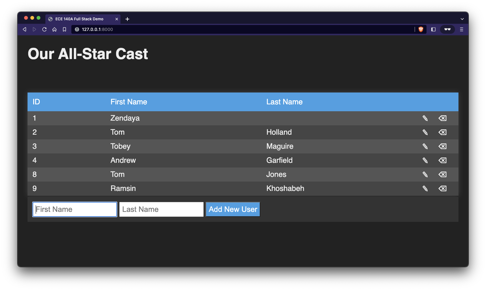

# FastAPI Full-Stack REST Demo

This repo is a full-stack app using the [FastAPI web framework](https://fastapi.tiangolo.com), MySQL for a database, and REST to interact with a simple users table. You may install MySQL natively or use the included Docker file to create a database in a containter. The `init-db.sql` defines a simple schema for use with the example.



## Prerequesites

You just need to have Python 3.7+ installed (3.10+ for the simplified typehinting).

## Usage

1. Create database credentials (specify your own **USERNAME**, **PASSWORD**, and **ROOT_PASSWORD**!)

    ```bash
    echo "MYSQL_HOST=localhost" > credentials.env
    echo "MYSQL_DATABASE=ece140" >> credentials.env
    echo "MYSQL_USER=USERNAME" >> credentials.env
    echo "MYSQL_PASSWORD=PASSWORD" >> credentials.env
    echo "MYSQL_ROOT_PASSWORD=ROOT_PASSWORD" >> credentials.env
    ```

2. If you have Docker installed, run the following command to start up a MySQL server (ignore this step if you already have MySQL installed and modify the `credentials.env` file to match your database credentials!). Run the command in a separate terminal window as it will lock up the window for logging.

    ```bash
    docker compose up --build &
    ```

    **Note:** Just closing the terminal will not stop the database server. In order to stop it, you must issue the command `docker-compose down` when you are finished.

3. Create a Python virtual environment

    ```bash
    python3 -m venv env
    ```

4. Start the virtual environment

    ```bash
    source env/bin/activate
    ```

5. Install dependencies

    ```bash
    pip install -U pip
    pip install -r requirements.txt
    ```

6. Run the server

    ```bash
    cd server
    python main.py
    ```

    or

    ```bash
    cd server
    uvicorn main:app --reload
    ```

7. If you prefer, there is a `main-pydantic.py` implementation as well. Instead of using the `request` object directly, this example uses the helpful Pydantic models to reduce cognitive load, so feel free to check that one out as well. Usage is exactly the same!

    ```bash
    cd server
    python main-pydantic.py
    ```

    or

    ```bash
    cd server
    uvicorn main-pydantic:app --reload
    ```
